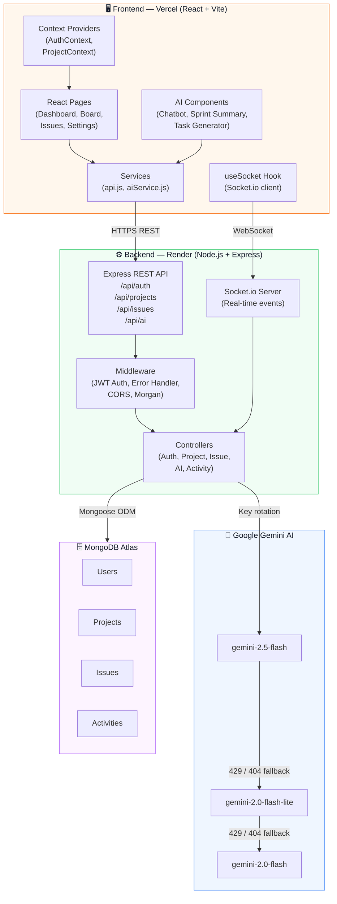
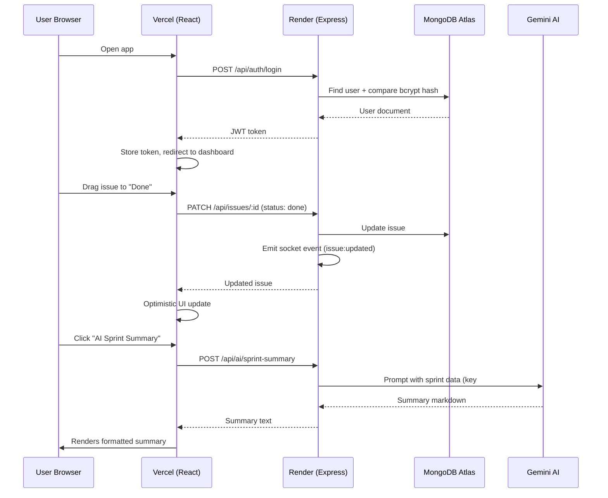

<div align="center">


# 🚀 Orbit — Tasks in Motion

**A full-stack project management web application inspired by Jira, built with the MERN stack and powered by Google Gemini AI.**

[](https://orbit-tasks-in-motion.vercel.app)
[](https://orbit-zk9e.onrender.com/api/health)
[](https://github.com/NISHANTH-KONCHADA/orbit)


</div>

---

## 📋 Table of Contents

- [Overview](#-overview)
- [Live Demo](#-live-demo)
- [Features](#-features)
- [Architecture](#-architecture)
- [Tech Stack](#-tech-stack)
- [Project Structure](#-project-structure)
- [Getting Started](#-getting-started)
- [Environment Variables](#-environment-variables)
- [API Reference](#-api-reference)
- [Deployment](#-deployment)
- [Demo Credentials](#-demo-credentials)

---

## 🌟 Overview

Orbit is a **production-ready project management platform** that brings Jira-like task tracking to the MERN stack. Teams can manage sprints, drag-and-drop issues across a Kanban board, communicate in real-time via Socket.io, and get AI-powered insights and automation through Google Gemini.

Built as a fully deployable full-stack application with:
- **JWT role-based authentication** (Admin / Project Manager / Developer)
- **Real-time collaboration** via Socket.io
- **AI-powered features** — task generator, sprint summarizer, floating chatbot
- **3-key Gemini API rotation** for uninterrupted AI service
- **Dark mode** with persistent preference
- **Responsive design** with a polished orange-accented UI

---

## 🌐 Live Demo

| Service | URL | Platform |
|---------|-----|----------|
| Frontend | https://orbit-tasks-in-motion.vercel.app | Vercel |
| Backend API | https://orbit-zk9e.onrender.com | Render |
| Health Check | https://orbit-zk9e.onrender.com/api/health | Render |

> **Note:** The backend runs on Render's free tier. If the first load is slow (~30s), the instance was sleeping — it will warm up and stay fast while you use it.

---

## ✨ Features

### 🔐 Authentication & Access Control
- JWT-based login and registration
- Role-based access control: **Admin**, **Project Manager**, **Developer**
- Protected routes with token refresh
- Secure password hashing with bcrypt

### 📋 Kanban Board
- **5 columns**: Backlog → Todo → In Progress → Review → Done
- **Drag-and-drop** powered by `@dnd-kit` with smooth animations
- Real-time board sync via Socket.io (changes appear instantly for all users)
- Per-column issue counts and color-coded priority badges

### 🎫 Issue Management
- Create, edit, delete issues with rich metadata
- **Issue types**: Bug 🐛 · Feature ✨ · Task ✅
- **Priority levels**: Low · Medium · High · Critical
- Assign to team members, set due dates, add labels
- Inline editing in the detail modal
- **Comment threads** with timestamps

### 📊 Dashboard & Analytics
- Sprint progress bar with completion percentage
- **Recharts donut chart** — issues by status
- **Bar chart** — issues by priority
- Live activity feed (recent team actions)
- AI Sprint Summary card

### 🤖 AI Features (Google Gemini)
| Feature | How to use |
|---------|-----------|
| **AI Task Generator** | Create Issue → type title → click ✨ AI Fill |
| **Sprint Summary** | Dashboard → AI Sprint Summary button |
| **Floating Chatbot** | Orange ✨ bubble (bottom-right corner) |
| **Auto Labels** | Automatically suggested from issue description |

**3-key rotation system**: Automatically cycles through 3 Gemini API keys across 3 models (`gemini-2.5-flash` → `gemini-2.0-flash-lite` → `gemini-2.0-flash`) — 9 total fallbacks before failing.

### 🌙 UX & Design
- Dark mode toggle with localStorage persistence
- Micro-animations and hover effects throughout
- Collapsible sidebar with project switcher
- Toast notifications for all actions
- Fully responsive layout

---

## 🏗️ Architecture



### Data Flow



---

## 🛠️ Tech Stack

### Frontend
| Technology | Purpose |
|-----------|---------|
| **React 18** | UI framework |
| **Vite** | Build tool + dev server |
| **Tailwind CSS v3** | Utility-first styling |
| **React Router v6** | Client-side routing |
| **@dnd-kit** | Drag-and-drop for Kanban |
| **Recharts** | Dashboard charts |
| **Socket.io-client** | Real-time updates |
| **Axios** | HTTP requests |
| **React Hot Toast** | Toast notifications |
| **Lucide React** | Icon library |
| **React Markdown** | AI response rendering |

### Backend
| Technology | Purpose |
|-----------|---------|
| **Node.js 24** | Runtime |
| **Express.js 4** | REST API framework |
| **MongoDB Atlas** | Cloud database |
| **Mongoose 8** | ODM + schema validation |
| **Socket.io 4** | WebSocket server |
| **JWT (jsonwebtoken)** | Authentication |
| **bcryptjs** | Password hashing |
| **Morgan** | HTTP request logging |
| **express-async-handler** | Async error handling |
| **@google/generative-ai** | Gemini AI SDK |

### DevOps & Deployment
| Tool | Purpose |
|------|---------|
| **Vercel** | Frontend hosting (CDN) |
| **Render** | Backend hosting |
| **MongoDB Atlas** | Database hosting (M0 free) |
| **GitHub** | Version control + CI/CD trigger |

---

## 📁 Project Structure

```
orbit/
├── 📄 README.md
├── 📄 render.yaml              # Render deployment config
├── 📄 .gitignore
│
├── 📂 server/                  # Express + Node.js backend
│   ├── 📄 server.js            # Entry point (DNS fix + Express + Socket.io)
│   ├── 📄 seeder.js            # Demo data seeder
│   ├── 📄 .env.example         # Environment variable template
│   ├── 📂 models/
│   │   ├── User.js             # User schema (name, email, role, bcrypt)
│   │   ├── Project.js          # Project schema (members, sprint, color)
│   │   ├── Issue.js            # Issue schema (status, priority, type, comments)
│   │   └── Activity.js         # Activity log schema
│   ├── 📂 controllers/
│   │   ├── authController.js   # Register, login, profile
│   │   ├── projectController.js # CRUD + member management
│   │   ├── issueController.js  # CRUD + status updates + comments
│   │   └── aiController.js     # Gemini AI with 3-key rotation
│   ├── 📂 routes/
│   │   ├── auth.js
│   │   ├── projects.js
│   │   ├── issues.js
│   │   └── ai.js
│   ├── 📂 middleware/
│   │   ├── auth.js             # JWT protect + role guard
│   │   └── errorHandler.js     # Global error handler
│   └── 📂 socket/
│       └── socketHandler.js    # Real-time event handlers
│
└── 📂 client/                  # React + Vite frontend
    ├── 📄 index.html
    ├── 📄 vite.config.js       # Proxy to localhost:5000 in dev
    ├── 📄 tailwind.config.js   # Orbit color tokens + animations
    ├── 📄 vercel.json          # SPA rewrite rules
    ├── 📄 .env.example
    └── 📂 src/
        ├── 📄 App.jsx          # Router + keep-alive ping
        ├── 📄 main.jsx         # React entry + dark mode init
        ├── 📄 index.css        # Design system + component classes
        ├── 📂 context/
        │   ├── AuthContext.jsx  # JWT state + login/logout
        │   └── ProjectContext.jsx # Issues, projects, socket state
        ├── 📂 components/
        │   ├── layout/         # Sidebar, Navbar, AppLayout
        │   ├── kanban/         # Column, IssueCard
        │   ├── issue/          # IssueModal, CreateIssueModal
        │   ├── project/        # CreateProjectModal
        │   ├── ai/             # AIChatBot
        │   └── ui/             # Modal, Badge, Avatar
        ├── 📂 pages/
        │   ├── Dashboard.jsx
        │   ├── Board.jsx
        │   ├── Issues.jsx
        │   ├── Settings.jsx
        │   ├── Login.jsx
        │   └── Register.jsx
        ├── 📂 services/
        │   ├── api.js          # Axios instance with JWT interceptor
        │   └── aiService.js    # AI endpoint wrappers
        ├── 📂 hooks/
        │   ├── useAuth.js
        │   └── useSocket.js
        └── 📂 utils/
            ├── helpers.js      # timeAgo, formatDate, priorityColor
            └── constants.js    # Statuses, priorities, types
```

---

## 🚀 Getting Started

### Prerequisites
- **Node.js** v18+
- **npm** v9+
- **MongoDB Atlas** account (free tier works)
- **Google Gemini API key** — [Get one here](https://aistudio.google.com/apikey)

### 1. Clone the Repository
```bash
git clone https://github.com/NISHANTH-KONCHADA/orbit.git
cd orbit
```

### 2. Set Up the Backend
```bash
cd server
npm install
cp .env.example .env
# Edit .env with your MongoDB URI and API keys (see Environment Variables below)
```

### 3. Set Up the Frontend
```bash
cd ../client
npm install
cp .env.example .env
# .env already points to localhost:5000 by default
```

### 4. Seed the Database
```bash
cd ../server
npm run seed
```

This creates:
- 3 demo users (Admin, PM, Developer)
- 1 sample project with Sprint 1
- 12 sample issues across all statuses

### 5. Run Both Servers

**Terminal 1 — Backend:**
```bash
cd server
npm run dev
# ✅ MongoDB Atlas connected
# 🚀 Orbit server running on http://localhost:5000
```

**Terminal 2 — Frontend:**
```bash
cd client
npm run dev
# ➜  Local:   http://localhost:5173/
```

Open **http://localhost:5173** in your browser.

---

## 🔐 Environment Variables

### `server/.env`
```env
# MongoDB Atlas connection string
MONGO_URI=mongodb+srv://<user>:<password>@<cluster>.mongodb.net/orbit?retryWrites=true&w=majority

# JWT signing secret (any long random string)
JWT_SECRET=your_super_secret_jwt_key_min_32_chars

# Gemini API keys — auto-rotated on quota limit (get from aistudio.google.com)
GEMINI_KEY_1=AIza...
GEMINI_KEY_2=AIza...   # optional, adds redundancy
GEMINI_KEY_3=AIza...   # optional, adds redundancy

# Production frontend URL (used for CORS)
CLIENT_URL=https://your-app.vercel.app

# Server port (default 5000)
PORT=5000
```

### `client/.env`
```env
VITE_API_URL=http://localhost:5000/api
VITE_SOCKET_URL=http://localhost:5000
```

---

## 📡 API Reference

### Authentication
| Method | Endpoint | Description | Auth |
|--------|----------|-------------|------|
| `POST` | `/api/auth/register` | Create account | ❌ |
| `POST` | `/api/auth/login` | Login + get JWT | ❌ |
| `GET` | `/api/auth/me` | Get current user | ✅ |
| `PUT` | `/api/auth/profile` | Update profile | ✅ |

### Projects
| Method | Endpoint | Description | Auth |
|--------|----------|-------------|------|
| `GET` | `/api/projects` | List user's projects | ✅ |
| `POST` | `/api/projects` | Create project | ✅ |
| `GET` | `/api/projects/:id` | Get project details | ✅ |
| `PUT` | `/api/projects/:id` | Update project | ✅ Admin/PM |
| `DELETE` | `/api/projects/:id` | Delete project | ✅ Admin |
| `GET` | `/api/projects/:id/activity` | Get activity feed | ✅ |

### Issues
| Method | Endpoint | Description | Auth |
|--------|----------|-------------|------|
| `GET` | `/api/issues?project=:id` | List issues | ✅ |
| `POST` | `/api/issues` | Create issue | ✅ |
| `GET` | `/api/issues/:id` | Get issue detail | ✅ |
| `PUT` | `/api/issues/:id` | Update issue / move status | ✅ |
| `DELETE` | `/api/issues/:id` | Delete issue | ✅ Admin/PM |
| `POST` | `/api/issues/:id/comments` | Add comment | ✅ |
| `DELETE` | `/api/issues/:id/comments/:cid` | Delete comment | ✅ |

### AI
| Method | Endpoint | Description | Auth |
|--------|----------|-------------|------|
| `POST` | `/api/ai/generate-task` | AI-fill issue from title | ✅ |
| `POST` | `/api/ai/chat` | Chatbot with project context | ✅ |
| `POST` | `/api/ai/sprint-summary` | Sprint report in markdown | ✅ |
| `POST` | `/api/ai/auto-label` | Suggest labels from description | ✅ |
| `GET` | `/api/ai/status` | Active key + model info | ✅ |

### System
| Method | Endpoint | Description |
|--------|----------|-------------|
| `GET` | `/api/health` | Health check (used by keep-alive) |

---

## 🚢 Deployment

### Backend → Render.com
1. Push code to GitHub
2. Go to [render.com](https://render.com) → **New → Web Service**
3. Connect GitHub → select `orbit` repo
4. Configure:
   - **Root Directory:** `server`
   - **Build Command:** `npm install`
   - **Start Command:** `node server.js`
5. Add all environment variables in **Environment** tab
6. Add Render's outbound IPs to **MongoDB Atlas Network Access**:
   - `74.220.52.0/24`
   - `74.220.60.0/24`

### Frontend → Vercel
1. Go to [vercel.com](https://vercel.com) → **New Project → Import from GitHub**
2. Select the `orbit` repo
3. Configure:
   - **Root Directory:** `client`
   - **Framework:** Vite
4. Add environment variables:
   ```
   VITE_API_URL = https://your-render-app.onrender.com/api
   VITE_SOCKET_URL = https://your-render-app.onrender.com
   ```
5. Deploy ✅
6. Copy the Vercel URL → update `CLIENT_URL` in Render environment

> The `render.yaml` and `vercel.json` files are already configured — both platforms auto-detect them.

### Database → MongoDB Atlas (Free M0)
1. Create cluster at [cloud.mongodb.com](https://cloud.mongodb.com)
2. **Database Access** → create user with `readWrite` on `orbit` database
3. **Network Access** → add your IP + Render's IPs (or `0.0.0.0/0` for dev)
4. Get connection string → paste into `MONGO_URI`

---

## 🎭 Demo Credentials

| Role | Email | Password | Access |
|------|-------|----------|--------|
| **Admin** | `admin@orbit.dev` | `orbit123` | Full access — manage members, delete anything |
| **Project Manager** | `pm@orbit.dev` | `orbit123` | Create/edit projects and issues |
| **Developer** | `dev@orbit.dev` | `orbit123` | View and update assigned issues |

### Reset Demo Data
```bash
cd server
node seeder.js --clear   # wipe all demo data
npm run seed             # re-seed fresh data
```

---

## 🧰 Available Scripts

### Server (`/server`)
```bash
npm run dev     # Start with nodemon (hot reload)
npm start       # Start for production
npm run seed    # Seed demo data
node seeder.js --clear  # Clear all data
```

### Client (`/client`)
```bash
npm run dev     # Vite dev server (http://localhost:5173)
npm run build   # Production build → dist/
npm run preview # Preview production build locally
```

---

## 🤝 Contributing

1. Fork the repo
2. Create a feature branch: `git checkout -b feat/your-feature`
3. Commit with conventional commits: `git commit -m "feat: add X"`
4. Push and open a PR

---

## 👤 Author

**Nishanth Konchada**
- GitHub: [@NISHANTH-KONCHADA](https://github.com/NISHANTH-KONCHADA)

---

## 📄 License

This project is open source and available under the [MIT License](LICENSE).

---

<div align="center">

**Built with ❤️ using the MERN stack + Google Gemini AI**

⭐ Star this repo if you found it helpful!

</div>
